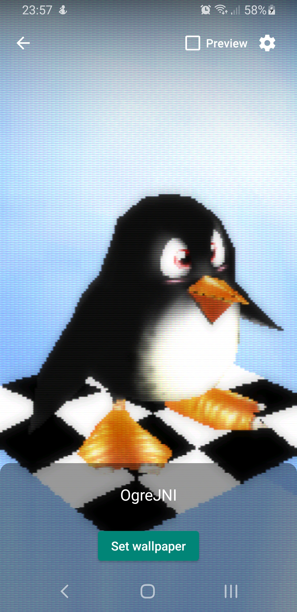

# OGRE Wallpaper

A fork (of sorts) of the [OGRE SDK](https://github.com/OGRECave/ogre) [for Android](https://cloudsmith.io/~ogrecave/repos/ogre/packages/detail/ogre-sdk-android-v1127-arm64-v8azip-6K7/), with templates designed to be used as a base for easy live wallpaper creation.
Comes with stylish Playstation 1-style shaders!

## Description

[OGRE](https://github.com/OGRECave/ogre) is a scene-oriented, cross-platform graphics engine. Being fully open-source and without the extra weight of a full game engine makes it ideal for creating minimal graphics applications such as live wallpapers.
This project aims to provide the boilerplate necessary to get these kinds of wallpapers up and running in Android.

## Getting Started

The project directory is openable in Android Studio.
OgreWallpaperService provides the main interface to the Android live wallpaper system - you just have to give it your own subclass of OgreRenderer which implements the `setUpScene` and `updateScene` functions.
ExampleSceneRenderer does this already, so you can simply replace or modify it.

Right now, "running" the Android app will simply open a blank Activity. To test the wallpaper itself, you must go to the live wallpapers menu in your device's settings.

## Authors

[Robert Poncelet](https://github.com/RobertPoncelet)

## License

This project is licensed under the MIT License - see the LICENSE.txt file for details.

## Acknowledgments

[OGRE](https://github.com/OGRECave/ogre)